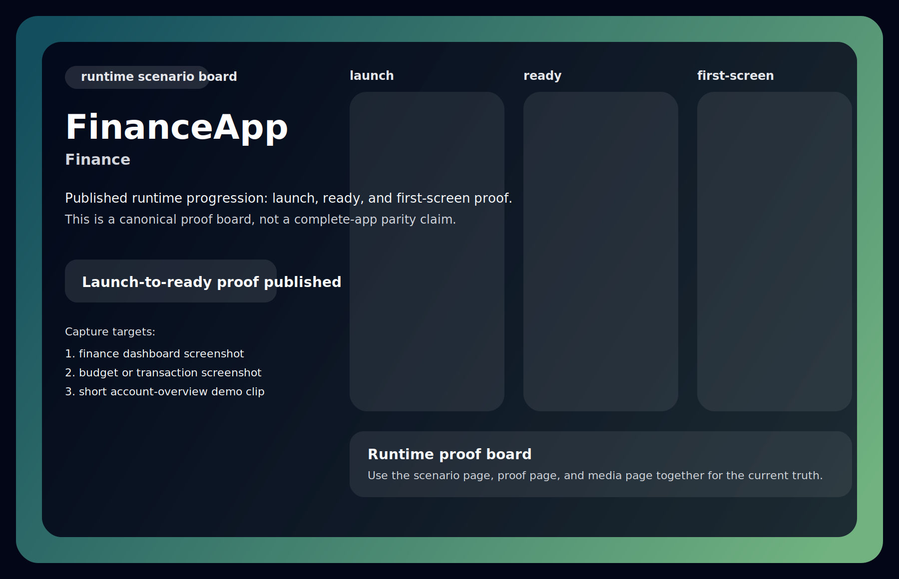
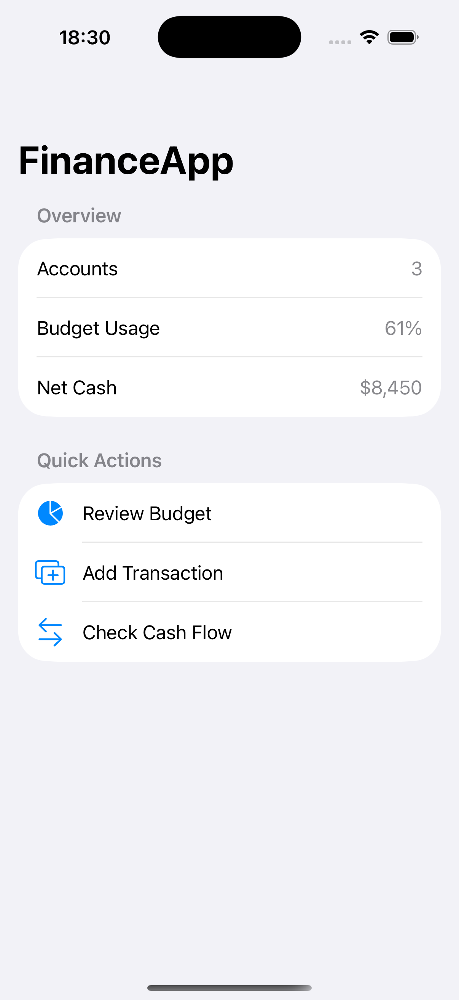
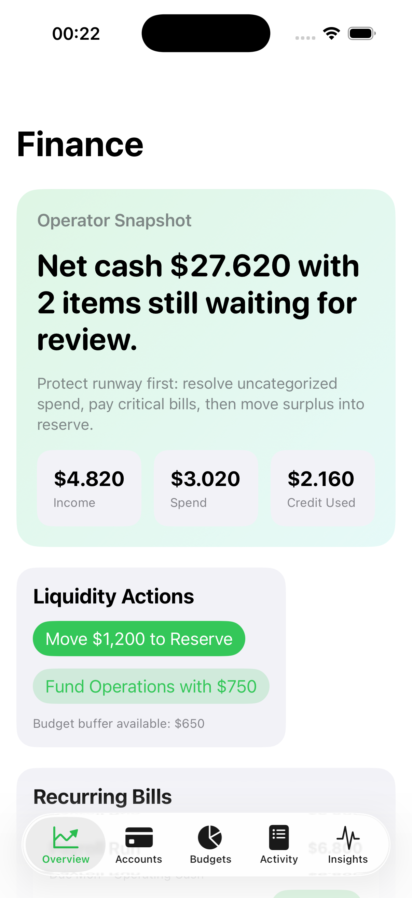
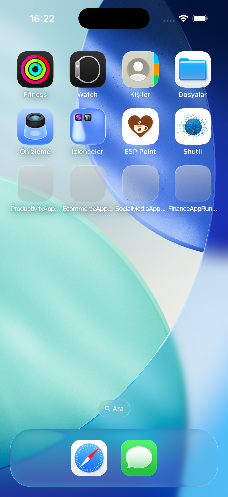

# FinanceApp Runtime Scenario

Generated from `Documentation/app-surface-catalog.json`.

- App: `FinanceApp`
- Lane: `Finance`
- Product target: `Finance / Budgeting`

## Scenario Truth

- this is a runtime progression page, not a complete-app claim
- the sequence below only proves launch, ready, and first-screen runtime states
- deeper interaction flows still require separate automation work

## Published Runtime Progression

### Scenario Board

### Launch Frame

### Ready Frame

### Runtime Screenshot

### Demo Clip

- [../Assets/AppDemoClips/FinanceApp.mp4](../Assets/AppDemoClips/FinanceApp.mp4)

## Canonical References

- [App Proof Surface](../App-Proofs/FinanceApp.md)
- [App Media Surface](../App-Media/FinanceApp.md)
- [App Gallery](../App-Gallery.md)
- [Scenario Router](../App-Scenarios/README.md)
