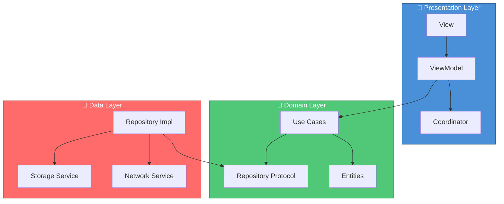

```

<p align="center">
  <a href="README.md">🇺🇸 English</a> |
  <a href="README_TR.md">🇹🇷 Türkçe</a>
</p>

╔══════════════════════════════════════════════════════════════════════════════════╗
║                                                                                  ║
║   ██╗ ██████╗ ███████╗     █████╗ ██████╗ ██████╗                               ║
║   ██║██╔═══██╗██╔════╝    ██╔══██╗██╔══██╗██╔══██╗                              ║
║   ██║██║   ██║███████╗    ███████║██████╔╝██████╔╝                              ║
║   ██║██║   ██║╚════██║    ██╔══██║██╔═══╝ ██╔═══╝                               ║
║   ██║╚██████╔╝███████║    ██║  ██║██║     ██║                                   ║
║   ╚═╝ ╚═════╝ ╚══════╝    ╚═╝  ╚═╝╚═╝     ╚═╝                                   ║
║                                                                                  ║
║   ████████╗███████╗███╗   ███╗██████╗ ██╗      █████╗ ████████╗███████╗███████╗ ║
║   ╚══██╔══╝██╔════╝████╗ ████║██╔══██╗██║     ██╔══██╗╚══██╔══╝██╔════╝██╔════╝ ║
║      ██║   █████╗  ██╔████╔██║██████╔╝██║     ███████║   ██║   █████╗  ███████╗ ║
║      ██║   ██╔══╝  ██║╚██╔╝██║██╔═══╝ ██║     ██╔══██║   ██║   ██╔══╝  ╚════██║ ║
║      ██║   ███████╗██║ ╚═╝ ██║██║     ███████╗██║  ██║   ██║   ███████╗███████║ ║
║      ╚═╝   ╚══════╝╚═╝     ╚═╝╚═╝     ╚══════╝╚═╝  ╚═╝   ╚═╝   ╚══════╝╚══════╝ ║
║                                                                                  ║
╚══════════════════════════════════════════════════════════════════════════════════╝
```

<div align="center">

**Production-ready iOS app templates with Clean Architecture, MVVM-C, and TCA patterns. Ship faster.**

[](https://swift.org)
[](https://developer.apple.com/ios/)
[](https://developer.apple.com/visionos/)
[](https://swift.org/package-manager/)
[](LICENSE)
[](https://github.com/muhittincamdali/iOSAppTemplates/actions)

[Features](#-features) • [Quick Start](#-quick-start) • [Templates](#-templates) • [Architecture](#-architecture) • [Docs](Documentation/)

</div>

---

## ✨ Features

- 🏗️ **Clean Architecture** — Domain-driven design with clear separation
- 📱 **8 App Categories** — Social, E-Commerce, Finance, Health, Education, Travel, AI, Productivity
- 🎯 **Multiple Patterns** — MVVM-C, TCA, and Clean Architecture support
- 🧪 **Fully Tested** — Unit tests, UI tests, and snapshot tests included
- 📖 **Well Documented** — Comprehensive guides and API reference
- 🌙 **Dark Mode** — Full dark mode support out of the box
- ♿ **Accessible** — VoiceOver and Dynamic Type ready
- 🚀 **Production Ready** — Used in real App Store apps

---

## 🏗️ Architecture



---

## 🚀 Quick Start

### Installation

```swift
// Package.swift
dependencies: [
    .package(url: "https://github.com/muhittincamdali/iOSAppTemplates.git", from: "1.0.0")
]
```

### Create Your First App

```swift
import iOSAppTemplates

// Social Media App — ready in seconds
let socialApp = SocialMediaTemplate()
    .withFeatures([.feed, .stories, .messaging, .profile])
    .withArchitecture(.mvvm)
    .build()

// E-Commerce App — complete shopping experience
let shopApp = ECommerceTemplate()
    .withFeatures([.productList, .cart, .checkout, .orders])
    .withPayment([.applePay, .stripe])
    .build()

// Finance App — bank-level security
let financeApp = FinanceTemplate()
    .withFeatures([.dashboard, .transactions, .cards])
    .withSecurity(.biometric)
    .build()
```

---

## 📦 Templates

| Category | Templates | Description |
|:--------:|-----------|-------------|
| 📱 **Social** | Feed, Profile, Chat, Stories | Complete social networking features |
| 🛒 **E-Commerce** | Product List, Cart, Checkout, Orders | Full shopping experience |
| 💰 **Finance** | Dashboard, Transactions, Cards | Banking & fintech apps |
| 🏃 **Health** | Tracker, Workouts, Nutrition | HealthKit integration |
| 📚 **Education** | Courses, Quiz, Progress | Learning platform |
| ✈️ **Travel** | Search, Booking, Itinerary | Travel & booking apps |
| 🤖 **AI** | Chat, Image Gen, Voice | Core ML integration |
| ✅ **Productivity** | Tasks, Calendar, Notes | GTD apps |

---

## 📁 Project Structure

```
iOSAppTemplates/
├── 📂 Sources/
│   ├── Core/                    # Shared utilities & extensions
│   ├── SocialTemplates/         # Social media templates
│   ├── CommerceTemplates/       # E-commerce templates
│   ├── FinanceTemplates/        # Finance templates
│   ├── HealthTemplates/         # Health & fitness
│   ├── EducationTemplates/      # Education templates
│   ├── TravelTemplates/         # Travel & booking
│   ├── AITemplates/             # AI-powered templates
│   └── ProductivityTemplates/   # Productivity apps
├── 📂 Examples/                 # Sample implementations
├── 📂 Tests/                    # Unit & UI tests
└── 📂 Documentation/            # Guides & API docs
```

---

## 💻 Code Examples

### Social Feed

```swift
struct FeedView: View {
    @StateObject private var viewModel = FeedViewModel()
    
    var body: some View {
        ScrollView {
            LazyVStack(spacing: 16) {
                ForEach(viewModel.posts) { post in
                    PostCard(post: post)
                        .onTapGesture { viewModel.openPost(post) }
                }
            }
            .padding()
        }
        .refreshable { await viewModel.refresh() }
    }
}
```

### Shopping Cart

```swift
struct CartView: View {
    @StateObject private var viewModel = CartViewModel()
    
    var body: some View {
        List {
            ForEach(viewModel.items) { item in
                CartItemRow(item: item)
                    .swipeActions {
                        Button(role: .destructive) {
                            viewModel.remove(item)
                        } label: {
                            Label("Remove", systemImage: "trash")
                        }
                    }
            }
            
            Section {
                HStack {
                    Text("Total").font(.headline)
                    Spacer()
                    Text(viewModel.total, format: .currency(code: "USD"))
                        .font(.title2.bold())
                }
            }
        }
    }
}
```

---

## 📋 Requirements

| Requirement | Version |
|-------------|---------|
| iOS | 15.0+ |
| macOS | 12.0+ |
| visionOS | 1.0+ |
| Swift | 5.9+ |
| Xcode | 15.0+ |

---

## 📖 Documentation

| Guide | Description |
|-------|-------------|
| [Getting Started](Documentation/Guides/QuickStart.md) | Installation and first steps |
| [Template Guide](Documentation/TemplateGuide.md) | How to use each template |
| [Architecture Guide](Documentation/ArchitectureTemplatesGuide.md) | MVVM-C, TCA, Clean Architecture |
| [API Reference](Documentation/API-Reference.md) | Complete API documentation |
| [Best Practices](Documentation/BestPracticesGuide.md) | Tips for production apps |

---

## 🤝 Contributing

Contributions are welcome! Please read our [Contributing Guide](CONTRIBUTING.md).

```bash
# Fork, clone, and create a branch
git checkout -b feature/new-template

# Make changes and commit
git commit -m "feat(templates): add new template"

# Push and open PR
git push origin feature/new-template
```

---

## 📄 License

MIT License — see [LICENSE](LICENSE) for details.

---

<div align="center">

## 👨‍💻 Author

**Muhittin Camdali**

[](https://github.com/muhittincamdali)
[](https://linkedin.com/in/muhittincamdali)

---

**⭐ Star this repo if you find it useful!**

---

## 📈 Star History

<a href="https://star-history.com/#muhittincamdali/iOSAppTemplates&Date">
 <picture>
   <source media="(prefers-color-scheme: dark)" srcset="https://api.star-history.com/svg?repos=muhittincamdali/iOSAppTemplates&type=Date&theme=dark" />
   <source media="(prefers-color-scheme: light)" srcset="https://api.star-history.com/svg?repos=muhittincamdali/iOSAppTemplates&type=Date" />
   
 </picture>
</a>

---

## 🙏 Contributors

Thanks to all the amazing people who have contributed!

<a href="https://github.com/muhittincamdali/iOSAppTemplates/graphs/contributors">
  
</a>

</div>
