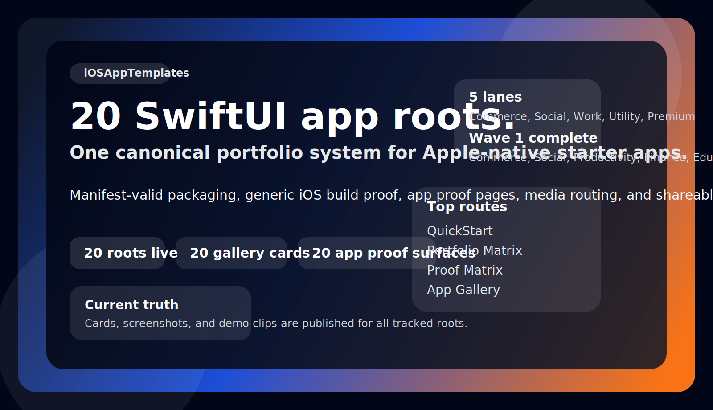
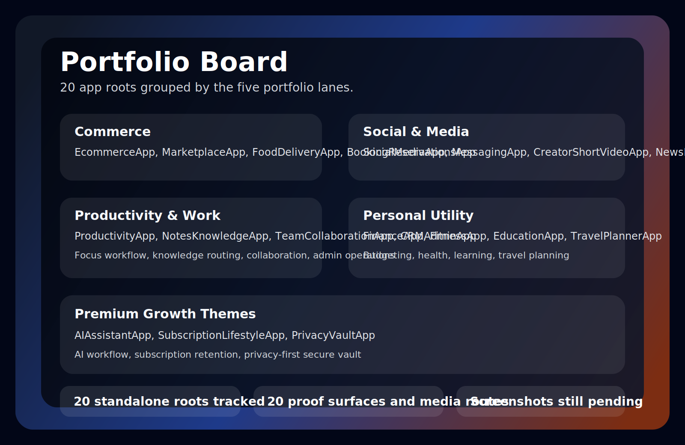

# iOSAppTemplates

Production-grade SwiftUI app starter system for Apple platforms.

`iOSAppTemplates` currently ships category-level template families, generator tooling, shared package targets, and `20` standalone app roots under `Templates/`. The product goal is broader: become the canonical SwiftUI starter portfolio with `20 provable complete apps`. The repository should only claim what can be routed, built, shown, and validated today.



## Signal Surface

| Signal | Current truth |
| --- | --- |
| Root coverage | `20` standalone app roots under `Templates/` |
| Build proof | local generic iOS `xcodebuild` tracked for `20` roots |
| Public proof | per-app proof and media pages exist for `20` roots |
| Visual layer | shareable gallery cards published for `20` roots |
| Remaining gap | screenshots, demo clips, hosted standalone iOS CI proof |

## First Decision

This repository is a strong fit if you want to:

- evaluate a broad SwiftUI starter portfolio from one codebase
- inspect reusable template families before building your own app
- generate a starter shell quickly from the CLI
- compare multiple architecture approaches in one repository

This repository is not yet a full fit if you expect:

- `20 complete apps` already shipping at equal maturity
- the same proof depth for every lane today
- published media and hosted standalone iOS proof for every standalone app



## Start Here

| Need | Start here |
| --- | --- |
| Evaluate the repo in 5 minutes | [Documentation/Guides/QuickStart.md](Documentation/Guides/QuickStart.md) |
| See the complete-app contract | [Documentation/Complete-App-Standard.md](Documentation/Complete-App-Standard.md) |
| See the current-vs-target portfolio map | [Documentation/Portfolio-Matrix.md](Documentation/Portfolio-Matrix.md) |
| See the tracked gallery surface | [Documentation/Template-Showcase.md](Documentation/Template-Showcase.md) |
| See lane-by-lane proof status | [Documentation/Proof-Matrix.md](Documentation/Proof-Matrix.md) |
| See canonical app proof pages | [Documentation/App-Proofs/README.md](Documentation/App-Proofs/README.md) |
| See canonical app media pages | [Documentation/App-Media/README.md](Documentation/App-Media/README.md) |
| See published gallery cards | [Documentation/App-Gallery.md](Documentation/App-Gallery.md) |
| Read the 20-app market strategy | [Documentation/World-Class-20-App-Strategy-2026-04-19.md](Documentation/World-Class-20-App-Strategy-2026-04-19.md) |
| See the Wave 1 execution plan | [Documentation/Wave-1-Implementation-Plan.md](Documentation/Wave-1-Implementation-Plan.md) |
| Inspect template families | [Documentation/TemplateGuide.md](Documentation/TemplateGuide.md) |
| Inspect the example router | [Examples/README.md](Examples/README.md) |
| Read the hard gap audit | [Documentation/World-Class-Audit-2026-04-15.md](Documentation/World-Class-Audit-2026-04-15.md) |

## What Ships Today

- category-level template families under `Sources/`
- `Scripts/TemplateGenerator.swift` as the generator entry point
- `20` standalone app roots under `Templates/`:
  - `Templates/EcommerceApp`
  - `Templates/SocialMediaApp`
  - `Templates/FitnessApp`
  - `Templates/ProductivityApp`
  - `Templates/FinanceApp`
  - `Templates/EducationApp`
  - `Templates/FoodDeliveryApp`
  - `Templates/TravelPlannerApp`
  - `Templates/AIAssistantApp`
  - `Templates/NewsBlogApp`
  - `Templates/MusicPodcastApp`
  - `Templates/MarketplaceApp`
  - `Templates/MessagingApp`
  - `Templates/BookingReservationsApp`
  - `Templates/NotesKnowledgeApp`
  - `Templates/CreatorShortVideoApp`
  - `Templates/TeamCollaborationApp`
  - `Templates/CRMAdminApp`
  - `Templates/SubscriptionLifestyleApp`
  - `Templates/PrivacyVaultApp`
- a lightweight example/router layer under `Examples/`
- active root-package validation for build, test, security, and performance

## Current Product Lanes

| Lane | Current surface | Target complete app |
| --- | --- | --- |
| Commerce | template family + standalone root + richer example | E-Commerce Store |
| Social | template family + standalone root + richer example | Social Media |
| News | template family + standalone root + richer example | News / Editorial |
| Marketplace | commerce family + standalone root + richer example | Marketplace |
| Messaging / Community | social family + standalone root + richer example | Messaging / Community |
| Booking / Reservations | travel family + standalone root + richer example | Booking & Reservations |
| Notes / Knowledge | productivity family + standalone root + richer example | Notes / Knowledge Base |
| Creator / Short Video | entertainment family + standalone root + richer example | Creator / Short Video |
| Team Collaboration | productivity family + standalone root + richer example | Team Collaboration |
| CRM / Admin | admin lane target + standalone root + richer example | CRM / Admin Companion |
| Subscription Lifestyle | premium lane target + standalone root + richer example | Subscription Lifestyle / Habit Tracker |
| Privacy / Secure Vault | security/privacy lane target + standalone root + richer example | Privacy / Secure Vault |
| Health / Fitness | template family + standalone root | Health / Fitness |
| Finance | template family + standalone root + richer example | Finance / Budgeting |
| Education | template family + standalone root + richer example | Education / Learning |
| Food Delivery | template family + standalone root + richer example | Food Delivery |
| Travel | template family + standalone root + richer example | Travel Planner |
| AI | template family + standalone root + richer example | AI Assistant |
| Music / Podcast | template family + standalone root + richer example | Music / Podcast |
| Productivity | template family + standalone root + richer example | Productivity / Tasks |

This table is not a `complete app` claim. It is the current packaging truth of the repository.

For the stronger current-vs-target view, use:

- [Documentation/Portfolio-Matrix.md](Documentation/Portfolio-Matrix.md)
- [Documentation/Template-Showcase.md](Documentation/Template-Showcase.md)
- [Documentation/Proof-Matrix.md](Documentation/Proof-Matrix.md)
- [Documentation/App-Proofs/README.md](Documentation/App-Proofs/README.md)
- [Documentation/Wave-1-Implementation-Plan.md](Documentation/Wave-1-Implementation-Plan.md)
- [Documentation/World-Class-20-App-Strategy-2026-04-19.md](Documentation/World-Class-20-App-Strategy-2026-04-19.md)

## Fastest Working Paths

### 1. Validate the root package graph

```bash
git clone https://github.com/muhittincamdali/iOSAppTemplates.git
cd iOSAppTemplates
swift build
swift test
```

### 2. Inspect a standalone app root

```bash
open Templates/SocialMediaApp/Package.swift
open Templates/EcommerceApp/Package.swift
open Templates/FitnessApp/Package.swift
open Templates/ProductivityApp/Package.swift
open Templates/FinanceApp/Package.swift
open Templates/EducationApp/Package.swift
open Templates/FoodDeliveryApp/Package.swift
open Templates/TravelPlannerApp/Package.swift
open Templates/AIAssistantApp/Package.swift
open Templates/NewsBlogApp/Package.swift
open Templates/MusicPodcastApp/Package.swift
open Templates/MarketplaceApp/Package.swift
open Templates/MessagingApp/Package.swift
open Templates/BookingReservationsApp/Package.swift
open Templates/NotesKnowledgeApp/Package.swift
open Templates/CreatorShortVideoApp/Package.swift
open Templates/TeamCollaborationApp/Package.swift
open Templates/CRMAdminApp/Package.swift
open Templates/SubscriptionLifestyleApp/Package.swift
open Templates/PrivacyVaultApp/Package.swift
```

This proves today:

- manifest-valid package entry
- lane-specific source shell
- standalone root packaging
- deterministic `Package.resolved` coverage for `8` standalone roots with external packages
- local generic iOS `xcodebuild` proof for `20` standalone roots:
  - `EcommerceApp`
  - `SocialMediaApp`
  - `FitnessApp`
  - `ProductivityApp`
  - `FinanceApp`
  - `EducationApp`
  - `FoodDeliveryApp`
  - `TravelPlannerApp`
  - `AIAssistantApp`
  - `NewsBlogApp`
  - `MusicPodcastApp`
  - `MarketplaceApp`
  - `MessagingApp`
  - `BookingReservationsApp`
  - `NotesKnowledgeApp`
  - `CreatorShortVideoApp`
  - `TeamCollaborationApp`
  - `CRMAdminApp`
  - `SubscriptionLifestyleApp`
  - `PrivacyVaultApp`

This does not yet prove today:

- published app media
- hosted standalone iOS CI proof for the tracked roots
- full complete-app parity for all lanes

### 3. Use the generator

```bash
swift Scripts/TemplateGenerator.swift --interactive
swift Scripts/TemplateGenerator.swift --list
```

## Quality Bar

- active root package graph builds
- active root package graph tests
- security smoke surface exists
- performance smoke surface exists
- tracked local generic iOS build proof exists for `20` standalone roots
- public docs are being tightened around truth-first product claims
- the repo now has explicit app proof, media, lockfile, and portfolio routers
- the repo now has published gallery cards for `20` standalone roots

## Canonical Docs

- [Documentation/README.md](Documentation/README.md)
- [Documentation/Guides/Installation.md](Documentation/Guides/Installation.md)
- [Documentation/API-Reference.md](Documentation/API-Reference.md)
- [Documentation/World-Class-20-App-Strategy-2026-04-19.md](Documentation/World-Class-20-App-Strategy-2026-04-19.md)

## Contributing

If you add a product claim, add the proof path too.

- [CONTRIBUTING.md](CONTRIBUTING.md)
- [SECURITY.md](SECURITY.md)
- [SUPPORT.md](SUPPORT.md)

## License

[MIT](LICENSE)
